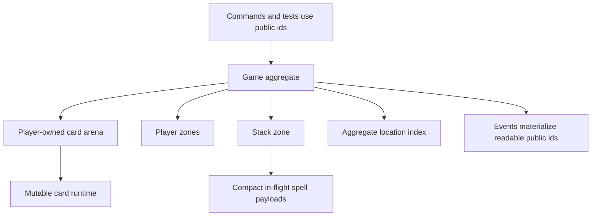
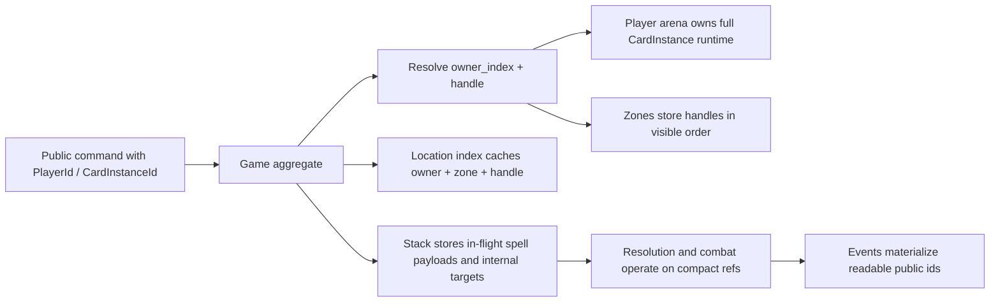

# Runtime Abstractions — DemonicTutor

This document explains the main runtime abstractions used by the current engine.

It is intentionally written in a Feynman style:

- what the abstraction is
- why it exists
- what problem it removes
- what its limits are

The goal is to reduce cognitive load for humans before they dive into the code.

---

# Why This Document Exists

DemonicTutor has grown a set of internal abstractions that are correct and efficient, but not all of them are obvious at first glance.

The code now optimizes for:

- deterministic domain behavior
- explicit aggregate ownership
- low duplication of state
- compact runtime representations
- clear outward-facing ids and events

That combination is good for the engine, but it also means some internal shapes are no longer "naive Rust structs with direct strings everywhere".

This document explains those choices in plain language.

---

# One Sentence Mental Model

The runtime is built around one idea:

**keep the inside compact and explicit, keep the outside readable and stable.**

That means:

- internal logic prefers indices, handles, and compact carriers
- public boundaries still expose stable ids and explicit events

---

# Big Picture

Read it like this:

- humans and tests talk to the system with readable ids
- the `Game` aggregate translates that into compact internal references
- runtime state lives in player-owned structures
- events convert the result back into readable public ids

---

# Abstraction 1: Dual-Layer Ids

## What It Is

Types like `GameId`, `PlayerId`, `CardInstanceId`, and `StackObjectId` now carry two layers:

- a numeric core identity
- a stable public string

## Explain It Like I Am New Here

Imagine a warehouse.

- inside the warehouse, boxes are easier to track with short numeric labels
- outside the warehouse, humans still want readable names on invoices

That is what these ids do.

Inside the engine:

- equality and hashing can rely on the compact numeric core

At the boundary:

- logs, events, tests, and commands still see readable strings like `player-1`

## Why It Exists

If the engine keeps strings as the canonical identity everywhere, it keeps paying:

- more memory
- more pointer chasing
- more hashing cost

The dual-layer id keeps the human-readable surface without forcing the runtime core to be string-first.

## What It Does Not Mean

It does **not** mean the public ids became unstable.

The public strings are still the reviewable identity at boundaries.

---

# Abstraction 2: Player-Owned Card Arena

## What It Is

Each `Player` owns a dense arena of their cards.

Cards are not scattered through every zone as independent owned objects. Instead:

- the arena owns the card runtime
- zones store references to arena entries

## Explain It Like I Am New Here

Think of a player having:

- one box with all real card objects
- several shelves that only store "which card is on this shelf"

The box is the arena.
The shelves are the zones.

This means moving a card between zones usually means:

- keep the real card where it is in the arena
- move only the internal reference between shelves

## Why It Exists

Without this pattern, the engine would constantly duplicate or relocate full card objects across:

- hand
- battlefield
- graveyard
- exile

The arena keeps ownership explicit and movements cheaper.

## Current Tradeoff

The player runtime is now handle-first at its core.

`CardInstanceId` still exists for commands, events, tests, and compatibility queries, but those lookups are treated as boundary concerns rather than as the canonical identity path inside `Player`.

---

# Abstraction 3: Handles

## What They Are

`PlayerCardHandle` is the compact internal reference to a card inside one player's arena.

## Explain It Like I Am New Here

If `CardInstanceId` is the card's public passport number, the handle is the seat number inside the player's own runtime storage.

The handle is not globally meaningful by itself.

It only makes sense together with its owner.

That is why many optimized paths use:

- `owner_index`
- `PlayerCardHandle`

instead of cloning a public `CardInstanceId`.

## Why It Exists

Handles are:

- smaller
- cheaper to compare
- better for locality

They are the engine's "inside the aggregate" identity.

---

# Abstraction 4: Zones As Views, Not Ownership Buckets

## What It Is

Most zones do not own full cards.

They are views over handles:

- `Hand`
- `Battlefield`
- `Graveyard`
- `Exile`
- `Library`

## Explain It Like I Am New Here

The runtime asks:

"Where is this card now?"

not

"Which zone owns the full object?"

That design makes zone transitions easier to reason about:

- ownership stays with the player arena
- zone state says where the card is visible

## Why It Exists

This keeps aggregate ownership simple:

- player owns cards
- zones describe card placement

That is much easier to evolve than spreading ownership across many containers.

---

# Abstraction 5: Ordered Zones With Visible Indexing

## What It Is

`Hand`, `Graveyard`, and `Exile` use an ordered storage abstraction that preserves visible order without relying on raw `Vec::remove` for every operation.

The current shape combines:

- reusable slots
- linked order
- an explicit visible index for fast positional lookup

## Explain It Like I Am New Here

There are really two problems in an ordered zone:

1. preserve the order people see
2. answer "what card is at position N?"

The linked slots solve stable order updates.
The visible-slot index solves fast `handle_at(N)`.

So the structure behaves like:

- a stable chain for mutations
- a small position index for reads

## Why It Exists

Earlier versions had two different pathologies:

- suffix rewrites on remove
- linear scans for visible index lookup

The current structure reduces both problems while keeping semantics honest.

## Current Limit

This is a strong practical structure for the current subset, but it is still a bespoke ordered-zone carrier, not a general-purpose sequence library.

That is intentional.

---

# Abstraction 6: Aggregate Card Location Index

## What It Is

`Game` maintains an aggregate-level location index for cards.

It maps a public card id to:

- owner index
- zone
- handle

## Explain It Like I Am New Here

Without this index, many rules would ask:

"search player 1"
"search player 2"
"search battlefield"
"search graveyard"

again and again.

The location index turns that into:

"we already know where this card is"

## Why It Exists

It cuts repeated scans in hot paths such as:

- targeting
- exile
- combat-related lookups

## Important Design Note

The index is part of the aggregate's runtime support structure.

It is not a second source of domain ownership.

The real owners are still:

- the `Game` aggregate
- the `Player` arenas and zones

The location index is a fast map over that owned state.

---

# Abstraction 7: Stack Objects Carry Compact Runtime Payloads

## What It Is

The stack no longer carries whole moved card runtimes.

A stack object carries only the in-flight data needed for the supported subset.

## Explain It Like I Am New Here

When a spell goes onto the stack, the engine does **not** want to drag around the whole card object plus all zone baggage.

Instead it carries a smaller "spell in flight" package.

That package says:

- what spell this is
- what target or controller matters
- what data must survive until resolution

In the current shape, the enum variant itself now carries more meaning.

So instead of "payload plus repeated card type field", the runtime prefers families like:

- creature payload
- instant payload
- sorcery payload
- artifact payload
- enchantment payload
- planeswalker payload

That keeps less repeated metadata inside each stack object.

## Why It Exists

This reduces:

- duplication
- zone churn
- semantic confusion between "card in a zone" and "spell on the stack"

The stack should model a spell in flight, not a full card pretending to still be in a zone.

## Current Mental Shortcut

If the arena models **where the full card lives**, then stack payloads model **what the game still needs while the spell is flying**.

---

# Abstraction 8: Internal Runtime Targets Vs Public Targets

## What It Is

The engine now separates:

- internal stack target references
- public target DTOs used at boundaries

## Explain It Like I Am New Here

Inside the engine, a target is best represented by:

- player index
- card handle
- location-aware internal reference

Outside the engine, humans and tests want:

- `PlayerId`
- `CardInstanceId`

So the runtime keeps internal references internally and only materializes public target ids when needed.

## Why It Exists

If internal stack logic keeps public ids everywhere, it becomes too easy to let boundary concerns leak back into hot paths.

This split keeps the line clear:

- runtime reference inside
- readable DTO outside

---

# Abstraction 9: Combat Participants Are Runtime References First

## What It Is

Combat damage participants now stay on internal references for longer.

## Explain It Like I Am New Here

During combat damage, the engine first needs to know:

- which attacker
- which blocker
- who is linked to whom

That information is cheaper and cleaner as internal references than as cloned public card ids.

Only when the engine emits `DamageEvent` does it convert back to public ids.

## Why It Exists

Combat is one of the hottest rule corridors in the engine.

Keeping it on handles longer reduces unnecessary public-id churn.

---

# How These Abstractions Fit Together

The important idea is not any single box.

The important idea is the direction:

- human-readable at the edges
- compact and explicit in the core

---

# How To Read The Code Without Getting Lost

Recommended order for a human reader:

1. read `docs/domain/aggregate-game.md`
2. read this document
3. read `docs/architecture/game-aggregate-structure.md`
4. then open the code under `src/domain/play/game/`

Recommended code reading order:

1. `src/domain/play/game/mod.rs`
2. `src/domain/play/game/model/player.rs`
3. `src/domain/play/zones.rs`
4. `src/domain/play/game/model/location_index.rs`
5. `src/domain/play/game/model/stack.rs`
6. one focused rule corridor such as combat or stack resolution

That order usually minimizes surprise.

---

# Practical Rule For Future Changes

When adding or refactoring a core abstraction, ask:

1. is this improving the inside of the engine or the boundary?
2. if it improves the inside, are we still keeping the outside readable?
3. if it improves the boundary, are we leaking boundary cost back into the runtime?

The best changes in this repository usually preserve this balance:

- compact core
- explicit domain semantics
- human-readable edges

---

# See Also

- `docs/architecture/system-overview.md`
- `docs/architecture/game-aggregate-structure.md`
- `docs/domain/aggregate-game.md`
- `docs/domain/current-state.md`
