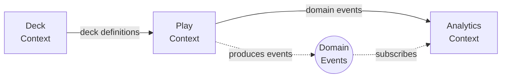

# Context Map — DemonicTutor

This document defines the initial bounded contexts of the system and their relationships.

The goal is to establish clear domain boundaries early.

---

---

# Bounded Contexts

The system is divided into three primary bounded contexts:

* play
* deck
* analytics

Each context owns a distinct part of the domain language and behavior.

---

# Play Context

## Responsibility

The play context models the runtime state of a game session.

It is responsible for:

* game lifecycle
* player participation
* zones
* turn progression
* phase progression
* action legality
* domain events produced by gameplay

---

## Core Concepts

Examples include:

* Game
* Player
* Turn
* Phase
* Priority
* Zone
* CardInstance

---

## Aggregate

The main aggregate is:

Game

Game protects invariants related to:

* turn order
* phase progression
* zone transitions
* action legality

---

# Deck Context

## Responsibility

The deck context models deck definitions independently from gameplay.

It is responsible for:

* deck composition
* card definitions
* import/export of deck lists
* deck metadata

Decks are static structures compared to gameplay state.

---

## Core Concepts

Examples include:

* Deck
* CardDefinition
* DeckEntry

Decks are used during game initialization but are not modified by gameplay rules.

---

# Analytics Context

## Responsibility

The analytics context derives information from gameplay events.

It does not influence gameplay legality.

Its role is observational.

---

## Core Concepts

Examples include:

* GameStatistics
* EventTimeline
* CardUsageMetrics
* ReplayModel

Analytics models are projections derived from domain events.

---

# Context Relationships

Deck → Play → Analytics

Deck provides deck definitions used to initialize a game.

Play produces domain events during gameplay.

Analytics consumes those events to produce derived insights.

Analytics never modifies gameplay state.

---

# Integration Style

Integration between contexts remains intentionally simple.

Deck data is read when a game starts.

Play produces domain events.

Analytics subscribes to those events.

This design supports:

* replayability
* observability
* loose coupling between concerns

---

## Maintenance note

If the bounded contexts or their relationships change, update both:
- the textual description
- the Mermaid diagram below

The text and diagram must remain consistent.
