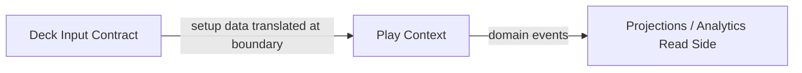

# Context Map — DemonicTutor

This document defines the bounded contexts of the DemonicTutor system and the relationships between them.

The goal is to establish clear domain boundaries and prevent responsibility leakage between parts of the system.

---



---

# Implemented vs Conceptual Boundaries

The current repository has:

* **one fully implemented bounded context: `Play`**
* **one conceptual upstream contract: deck-oriented input**
* **one downstream observational read side: projections and analytics**

This distinction matters: the map should describe the current modeled system, not only its future intent.

---

# Play Context (Core Domain)

The **Play context** models the runtime behavior of a match.

This is the **core domain** of DemonicTutor.

It is responsible for:

* game lifecycle
* player participation
* card zones
* turn progression
* phase progression
* action legality
* domain event production

---

## Core Concepts

Examples include:

* Game
* Player
* Turn
* Phase
* Zone
* CardInstance

The aggregate responsible for gameplay invariants is:

```
Game
```

---

# Deck Input Contract (Conceptual Upstream)

Deck data exists conceptually as an upstream source of truth, but it is **not yet implemented as a separate bounded context inside this repository**.

Responsibilities include:

* deck composition
* card definitions
* deck metadata
* import/export of deck lists

Decks are **static structures** used to initialize gameplay.

---

## Current Repository Boundary

Gameplay initialization accepts setup-oriented input and translates it into play-owned runtime library data before gameplay begins.

After initialization, deck definitions are not modified by gameplay.

---

# Projections / Analytics Read Side (Downstream Observational Area)

Analytics currently exists as projections and read-side processing derived from gameplay events.

It does not influence gameplay legality.

Its role is strictly **observational**, and it is not yet modeled as a fully separate bounded context with its own ubiquitous language and invariants.

Responsibilities include:

* match statistics
* event timelines
* replay models
* gameplay metrics

Current analytics concerns are projections derived from domain events.

---

# Context Relationships

The current repository follows a simple directional flow:

```
Deck input → Play → Projections / Analytics
```

### Deck Input Contract → Play

Relationship:

```
Upstream → Downstream
```

Deck-oriented input provides setup data required to initialize a match.

Play consumes that input and translates it into play-owned runtime data before the match begins.

---

### Play → Projections / Analytics

Relationship:

```
Publisher → Subscriber
```

Play produces domain events during gameplay.

Read-side consumers subscribe to those events to derive projections and statistics.

They never modify gameplay state.

---

# Integration Style

The integration model is intentionally simple.

Deck-oriented input is read when a game starts and translated at the application/domain boundary.

Play produces domain events.

Read-side consumers subscribe to those events.

This architecture enables:

* replayability
* observability
* separation between gameplay and read-side analysis
* incremental feature growth

---

# Evolution of the Context Map

New contexts may be introduced as the system evolves.

Possible future fully separated contexts include:

* **Deck**
* **Analytics**
* **Replay**
* **AI Analysis**

They should be introduced only when the current boundaries can no longer evolve safely without responsibility overlap.

---

## Maintenance Note

If the bounded contexts or their relationships change, both the textual description and the Mermaid diagram must be updated.

The diagram and text must always remain consistent.
